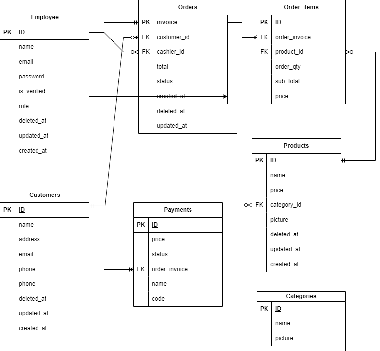

<h1>Deskripsi</h1>

<h2>Mvp Tambahan</h2>

1. Cashier dapat menambahkan customer.
   Saya menambahkan table customer supaya dapat membantu pemilik toko menganalisa data pelanggan, seperti menu apa yang sering dibeli dan dari mana asalnya. dan pada table orders.

2. Cashier dapat mengelola Order.
   Cashier adalah role yang mempunyai akses untuk membuat, menyelesaikan, dan membatalkan order. Serta menambahkan customer.

    1. field payment_id merupakan foreign key terhadap tabel payments dimana data pembayaran dalam transaksi tersebut akan disimpan di tabel tersebut
    2. field status pada table Orders
        - “unpaid“ adalah dimana order baru dibuat dan menunggu pembayaran dari pihak customers
        - “pending“ adalah dimana pembayaran dari pesanan tersebut telah dibyar tetapi belum ada action yang diberikan lebih lanjut.
        - “success” adalah status dimana order sudah diselesaikan. syarat success ini pembayaran sudah dilakukan.
        - “cancel” adalah status dimana order dibatalkan.

3. Admin dapat mengelola Menu.
   Admin adalah role yang mempunyai akses untuk mencetak atau menampilkan data laporan. Serta mengelola menu.

4. Pada aplikasi semua yang terdaftar sebagai employee dapat membuat kategori maupun produk.

\*nb: saya menambahkan sale price di table order_items karena ketika price di table product berubah supaya nanti pada saat admin mencetak data laporan mingguan atau bulanan harga bisa di sesuaikan dengan harga pada saat itu.

<h2>Tech Stack</h2>

1. Golang: untuk membangun web server ini saya akan memilih bahasa pemograman Golang dikarenakan golang mudah di scaling nantinya dan performanya sangat baik.
2. Echo: Karena menurut saya untuk saat ini dokumentasinya sangat lengkap dan fitur-fitur yang tersedia sudah lengkap sekali dan mudah dimengerti.
3. MySQL: karena menurut saya mysql merupakan DBMS yang saat ini banyak digunakan.
4. GORM: karena orm ini paling banyak digunakan serta menggunakan orm dapat mempermundah melakukan query ke database.
5. Reddis : sebenernya ini opsional saja tetapi jika user semakain banyak menurut saya perlu menggunkan caching agar responsennya cepat.
5. Midtrans: menggunakan midtrans sebagai payment gateway untuk pembayaran melalui transfer, credit card, ataupun qris. Dan untuk dokumentasinya sangat lengkap
6. GCP: digunakan untuk menyimpan gambar produk maupun kategori serta untuk mendeploy aplikasi ini ke cloud.
7. CI/CD: Gihub Action, jenkins
8. Promotheus Dan Grafana :  Menurut saya ini sangat dibutuhkan untuk proses monitoring secara realtime terhadap aplikasi kita seperti latency query kita agar suata saat nanti jika terdapat query yang kurang optimal bisa kita optimalkan.
9. GOmail(SMTP) :  untuk mengirimkan email terhadap pelanggan.
10. Cloudflare : untuk memberikan security lebih terhadap server utama kita. 

